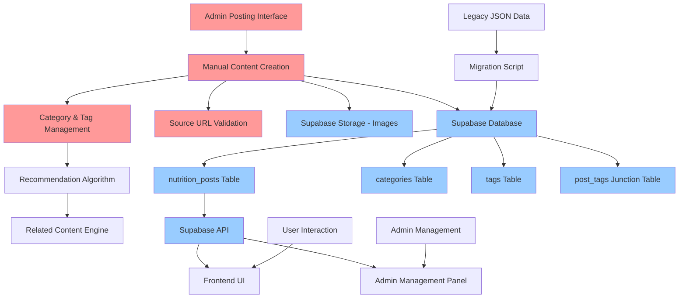

# Design Document

## Overview

최신영양정보 시스템을 자동 데이터 수집 방식에서 관리자 수동 포스팅 방식으로 전환하는 설계입니다. 기존의 자동 수집 관련 코드와 파일들을 제거하고, 관리자가 직접 영양 정보를 작성하고 관리할 수 있는 포스팅 시스템을 구축합니다. 카테고리와 태그 기반의 추천 알고리즘을 통해 사용자에게 관련 정보를 제공하며, 기존 데이터와의 호환성을 유지합니다.

## Architecture

### System Architecture (After Transformation with Supabase)



### Data Flow (Manual Posting)

1. **작성 단계**: 관리자가 포스팅 인터페이스에서 영양 정보 작성
2. **분류 단계**: 카테고리 선택 및 태그 입력으로 콘텐츠 분류
3. **검증 단계**: 원본 소스 URL 유효성 검증 및 이미지 업로드
4. **저장 단계**: 통합된 데이터 구조로 데이터베이스에 저장
5. **제공 단계**: 기존 API를 통해 프론트엔드에 정보 제공
6. **추천 단계**: 카테고리/태그 기반 관련 정보 추천

## Components and Interfaces

### 1. Code Removal Layer

#### Files to Remove
```javascript
// 제거할 파일 목록
const filesToRemove = [
    // 데이터 수집 스크립트들
    'collect-all-data.js',
    'collect-news-data.js',
    'collect-papers-and-news-optimized.js',
    'collect-pubmed-data.js',
    'collect-youtube-data.js',
    'scripts/collect-real-nutrition-data.js',
    'scripts/collect-youtube-with-thumbnails.js',
    
    // 유틸리티 클래스들
    'utils/contentAggregator.js',
    'utils/dataCollectionScheduler.js',
    'utils/pubmedApiService.js',
    'utils/pubmedApiServiceOptimized.js',
    'utils/youtubeApiService.js',
    'utils/newsApiService.js',
    'utils/aiContentProcessor.js',
    'utils/aiContentProcessorOptimized.js',
    'utils/contentQualityAssessor.js',
    
    // 배치 파일들
    'manual-collect.bat',
    'restart-collection.bat'
];
```

#### Code Sections to Remove from server.js
```javascript
// 제거할 코드 섹션들
const codeToRemove = [
    // 자동 수집 관련 import들
    'ContentAggregator',
    'AIContentProcessor',
    'DataCollectionScheduler',
    'pubmedApiService',
    'youtubeApiService',
    'newsApiService',
    
    // 스케줄러 초기화 코드
    'dataCollectionScheduler 관련 모든 코드',
    
    // 관리자 페이지의 수집 관련 UI 요소들
    'admin.html의 데이터 수집 섹션'
];
```

### 2. Manual Posting Interface

#### Admin Posting Form Component
```javascript
class AdminPostingForm {
    constructor() {
        this.form = null;
        this.categories = [];
        this.tags = [];
    }
    
    // 폼 렌더링
    renderForm() {
        return `
            <form id="nutrition-posting-form">
                <div class="form-group">
                    <label for="title">제목 *</label>
                    <input type="text" id="title" name="title" required>
                </div>
                
                <div class="form-group">
                    <label for="summary">요약 *</label>
                    <textarea id="summary" name="summary" rows="3" required></textarea>
                </div>
                
                <div class="form-group">
                    <label for="content">내용 *</label>
                    <textarea id="content" name="content" rows="10" required></textarea>
                </div>
                
                <div class="form-group">
                    <label for="category">카테고리 *</label>
                    <select id="category" name="category" required>
                        <option value="">카테고리 선택</option>
                        <option value="diet">식단</option>
                        <option value="supplements">보충제</option>
                        <option value="research">연구</option>
                        <option value="trends">트렌드</option>
                    </select>
                    <input type="text" id="new-category" placeholder="새 카테고리 입력">
                </div>
                
                <div class="form-group">
                    <label for="tags">태그</label>
                    <input type="text" id="tags" name="tags" placeholder="태그를 쉼표로 구분하여 입력">
                    <div id="tag-suggestions"></div>
                </div>
                
                <div class="form-group">
                    <label for="sourceUrl">원본 소스 URL</label>
                    <input type="url" id="sourceUrl" name="sourceUrl" placeholder="https://...">
                    <button type="button" id="validate-url">URL 검증</button>
                </div>
                
                <div class="form-group">
                    <label for="image">이미지 업로드</label>
                    <input type="file" id="image" name="image" accept="image/*">
                    <div id="image-preview"></div>
                </div>
                
                <div class="form-actions">
                    <button type="submit">게시</button>
                    <button type="button" id="save-draft">임시저장</button>
                    <button type="button" id="preview">미리보기</button>
                </div>
            </form>
        `;
    }
    
    // 폼 이벤트 처리
    handleSubmit(event) {}
    handleImageUpload(event) {}
    validateSourceUrl(url) {}
    suggestTags(input) {}
}
```

#### Category and Tag Management
```javascript
class CategoryTagManager {
    constructor() {
        this.categories = new Set();
        this.tags = new Set();
    }
    
    // 카테고리 관리
    async getCategories() {}
    async addCategory(category) {}
    async updateCategory(oldName, newName) {}
    async deleteCategory(category) {}
    
    // 태그 관리
    async getTags() {}
    async addTag(tag) {}
    async getTagSuggestions(input) {}
    async getRelatedTags(tags) {}
    
    // 추천 알고리즘
    async getRelatedContent(categories, tags, limit = 5) {}
}
```

### 3. Supabase Database Schema

#### Nutrition Posts Table (nutrition_posts)
```sql
CREATE TABLE nutrition_posts (
    id UUID PRIMARY KEY DEFAULT gen_random_uuid(),
    title TEXT NOT NULL,
    summary TEXT NOT NULL,
    content TEXT NOT NULL,
    source_type TEXT NOT NULL DEFAULT 'manual', -- 'manual', 'paper', 'youtube', 'news'
    source_url TEXT,
    source_name TEXT,
    author TEXT,
    published_date TIMESTAMPTZ DEFAULT NOW(),
    collected_date TIMESTAMPTZ DEFAULT NOW(),
    trust_score INTEGER DEFAULT 100,
    category_id UUID REFERENCES categories(id),
    image_url TEXT,
    language TEXT DEFAULT 'ko',
    is_active BOOLEAN DEFAULT true,
    view_count INTEGER DEFAULT 0,
    like_count INTEGER DEFAULT 0,
    bookmark_count INTEGER DEFAULT 0,
    
    -- 수동 포스팅 전용 필드
    is_manual_post BOOLEAN DEFAULT true,
    admin_id UUID,
    admin_name TEXT,
    is_draft BOOLEAN DEFAULT false,
    last_modified TIMESTAMPTZ DEFAULT NOW(),
    
    created_at TIMESTAMPTZ DEFAULT NOW(),
    updated_at TIMESTAMPTZ DEFAULT NOW()
);
```

#### Categories Table
```sql
CREATE TABLE categories (
    id UUID PRIMARY KEY DEFAULT gen_random_uuid(),
    name TEXT UNIQUE NOT NULL,
    description TEXT,
    post_count INTEGER DEFAULT 0,
    created_at TIMESTAMPTZ DEFAULT NOW(),
    updated_at TIMESTAMPTZ DEFAULT NOW()
);

-- 기본 카테고리 데이터
INSERT INTO categories (name, description) VALUES
('diet', '식단 관련 영양 정보'),
('supplements', '영양 보충제 관련 정보'),
('research', '영양학 연구 정보'),
('trends', '영양 트렌드 정보');
```

#### Tags Table
```sql
CREATE TABLE tags (
    id UUID PRIMARY KEY DEFAULT gen_random_uuid(),
    name TEXT UNIQUE NOT NULL,
    post_count INTEGER DEFAULT 0,
    created_at TIMESTAMPTZ DEFAULT NOW()
);
```

#### Post Tags Junction Table
```sql
CREATE TABLE post_tags (
    post_id UUID REFERENCES nutrition_posts(id) ON DELETE CASCADE,
    tag_id UUID REFERENCES tags(id) ON DELETE CASCADE,
    PRIMARY KEY (post_id, tag_id)
);
```

#### Modification History Table
```sql
CREATE TABLE post_modification_history (
    id UUID PRIMARY KEY DEFAULT gen_random_uuid(),
    post_id UUID REFERENCES nutrition_posts(id) ON DELETE CASCADE,
    admin_id UUID,
    admin_name TEXT,
    changes TEXT,
    created_at TIMESTAMPTZ DEFAULT NOW()
);
```

#### Supabase Manual Posting Service
```javascript
class SupabaseManualPostingService {
    constructor(supabaseClient) {
        this.supabase = supabaseClient;
    }
    
    // 포스팅 생성
    async createPost(postData, adminInfo) {
        const { data: post, error: postError } = await this.supabase
            .from('nutrition_posts')
            .insert({
                title: postData.title,
                summary: postData.summary,
                content: postData.content,
                source_url: postData.sourceUrl,
                source_name: postData.sourceName,
                category_id: postData.categoryId,
                image_url: postData.imageUrl,
                is_draft: postData.isDraft || false,
                admin_id: adminInfo.id,
                admin_name: adminInfo.name
            })
            .select()
            .single();
            
        if (postError) throw postError;
        
        // 태그 연결
        if (postData.tags && postData.tags.length > 0) {
            await this.attachTags(post.id, postData.tags);
        }
        
        return post;
    }
    
    // 태그 연결
    async attachTags(postId, tagNames) {
        for (const tagName of tagNames) {
            // 태그가 없으면 생성
            const { data: tag } = await this.supabase
                .from('tags')
                .upsert({ name: tagName.trim() })
                .select()
                .single();
                
            // 포스트-태그 연결
            await this.supabase
                .from('post_tags')
                .upsert({ post_id: postId, tag_id: tag.id });
        }
    }
    
    // 포스팅 수정
    async updatePost(id, updates, adminInfo) {
        const { data, error } = await this.supabase
            .from('nutrition_posts')
            .update({
                ...updates,
                last_modified: new Date().toISOString(),
                updated_at: new Date().toISOString()
            })
            .eq('id', id)
            .select()
            .single();
            
        if (error) throw error;
        
        // 수정 이력 기록
        await this.supabase
            .from('post_modification_history')
            .insert({
                post_id: id,
                admin_id: adminInfo.id,
                admin_name: adminInfo.name,
                changes: JSON.stringify(updates)
            });
            
        return data;
    }
    
    // 포스팅 목록 조회 (관리자용)
    async getAdminPosts(adminId, filters = {}) {
        let query = this.supabase
            .from('nutrition_posts')
            .select(`
                *,
                categories(name),
                post_tags(tags(name))
            `)
            .eq('admin_id', adminId);
            
        if (filters.status === 'draft') {
            query = query.eq('is_draft', true);
        } else if (filters.status === 'published') {
            query = query.eq('is_draft', false).eq('is_active', true);
        }
        
        const { data, error } = await query.order('created_at', { ascending: false });
        
        if (error) throw error;
        return data;
    }
}
```

### 4. API Layer Updates

#### New Admin API Endpoints
```javascript
// 기존 자동 수집 API 제거 후 새로운 수동 포스팅 API 추가
const newAdminEndpoints = {
    // 포스팅 관리
    'POST /api/admin/nutrition-info/posts': 'createPost',
    'PUT /api/admin/nutrition-info/posts/:id': 'updatePost',
    'DELETE /api/admin/nutrition-info/posts/:id': 'deletePost',
    'GET /api/admin/nutrition-info/posts': 'getAdminPosts',
    
    // 임시저장 관리
    'POST /api/admin/nutrition-info/drafts': 'saveDraft',
    'GET /api/admin/nutrition-info/drafts': 'getDrafts',
    'DELETE /api/admin/nutrition-info/drafts/:id': 'deleteDraft',
    
    // 카테고리/태그 관리
    'GET /api/admin/nutrition-info/categories': 'getCategories',
    'POST /api/admin/nutrition-info/categories': 'addCategory',
    'PUT /api/admin/nutrition-info/categories/:id': 'updateCategory',
    'DELETE /api/admin/nutrition-info/categories/:id': 'deleteCategory',
    
    'GET /api/admin/nutrition-info/tags': 'getTags',
    'GET /api/admin/nutrition-info/tags/suggestions': 'getTagSuggestions',
    
    // 이미지 업로드
    'POST /api/admin/nutrition-info/upload-image': 'uploadImage',
    
    // URL 검증
    'POST /api/admin/nutrition-info/validate-url': 'validateUrl'
};
```

#### Updated Public API Endpoints
```javascript
// 기존 API 유지하되 수동 포스팅 데이터도 포함하도록 수정
const updatedEndpoints = {
    'GET /api/nutrition-info': 'getNutritionInfoList', // 자동+수동 통합 조회
    'GET /api/nutrition-info/:id': 'getNutritionInfoById',
    'POST /api/nutrition-info/search': 'searchNutritionInfo',
    'GET /api/nutrition-info/categories': 'getCategories',
    'GET /api/nutrition-info/recommended': 'getRecommendedInfo', // 태그/카테고리 기반 추천
    'POST /api/nutrition-info/bookmark': 'toggleBookmark',
    'POST /api/nutrition-info/like': 'toggleLike'
};
```

### 5. Frontend Components Updates

#### Admin Posting Page
```javascript
class AdminPostingPage {
    constructor() {
        this.postingForm = new AdminPostingForm();
        this.postManager = new PostManager();
        this.categoryTagManager = new CategoryTagManager();
    }
    
    // 페이지 렌더링
    render() {
        return `
            <div class="admin-posting-container">
                <div class="posting-header">
                    <h2>영양 정보 포스팅</h2>
                    <div class="posting-actions">
                        <button id="new-post">새 포스팅</button>
                        <button id="manage-posts">포스팅 관리</button>
                        <button id="manage-categories">카테고리 관리</button>
                    </div>
                </div>
                
                <div class="posting-content">
                    <div class="posting-form-section">
                        ${this.postingForm.renderForm()}
                    </div>
                    
                    <div class="posting-preview-section">
                        <div id="preview-container"></div>
                    </div>
                </div>
                
                <div class="posts-management-section">
                    ${this.postManager.renderPostsList()}
                </div>
            </div>
        `;
    }
    
    // 이벤트 처리
    initializeEventHandlers() {}
}
```

#### Post Management Component
```javascript
class PostManager {
    constructor() {
        this.posts = [];
        this.filters = {};
    }
    
    // 포스팅 목록 렌더링
    renderPostsList() {
        return `
            <div class="posts-list-container">
                <div class="posts-filters">
                    <select id="status-filter">
                        <option value="">전체</option>
                        <option value="published">게시됨</option>
                        <option value="draft">임시저장</option>
                        <option value="inactive">비활성</option>
                    </select>
                    <select id="category-filter">
                        <option value="">전체 카테고리</option>
                    </select>
                    <input type="text" id="search-posts" placeholder="포스팅 검색">
                </div>
                
                <div class="posts-list">
                    <table id="posts-table">
                        <thead>
                            <tr>
                                <th>제목</th>
                                <th>카테고리</th>
                                <th>상태</th>
                                <th>작성일</th>
                                <th>조회수</th>
                                <th>관리</th>
                            </tr>
                        </thead>
                        <tbody id="posts-tbody">
                        </tbody>
                    </table>
                </div>
                
                <div class="posts-pagination">
                    <div id="pagination-controls"></div>
                </div>
            </div>
        `;
    }
    
    // 포스팅 관리 기능
    async loadPosts(filters = {}) {}
    async togglePostStatus(id) {}
    async editPost(id) {}
    async deletePost(id) {}
}
```

### 6. Recommendation Algorithm

#### Tag and Category Based Recommendation
```javascript
class RecommendationEngine {
    constructor(nutritionDataManager) {
        this.dataManager = nutritionDataManager;
    }
    
    // 카테고리 기반 추천
    async getRelatedByCategory(category, excludeId, limit = 5) {
        const filters = {
            category: category,
            excludeIds: [excludeId],
            isActive: true
        };
        
        const result = await this.dataManager.getNutritionInfoList(filters, { limit });
        return result.items || [];
    }
    
    // 태그 기반 추천
    async getRelatedByTags(tags, excludeId, limit = 5) {
        const filters = {
            tags: tags,
            excludeIds: [excludeId],
            isActive: true
        };
        
        // 태그 매칭 점수 계산
        const result = await this.dataManager.getNutritionInfoList(filters);
        const items = result.items || [];
        
        // 태그 일치도에 따른 점수 계산 및 정렬
        const scoredItems = items.map(item => {
            const matchingTags = item.tags.filter(tag => tags.includes(tag));
            const score = matchingTags.length / Math.max(tags.length, item.tags.length);
            return { ...item, relevanceScore: score };
        });
        
        return scoredItems
            .sort((a, b) => b.relevanceScore - a.relevanceScore)
            .slice(0, limit);
    }
    
    // 통합 추천 (카테고리 + 태그)
    async getRecommendedContent(nutritionInfo, limit = 5) {
        const categoryRelated = await this.getRelatedByCategory(
            nutritionInfo.category, 
            nutritionInfo.id, 
            Math.ceil(limit / 2)
        );
        
        const tagRelated = await this.getRelatedByTags(
            nutritionInfo.tags, 
            nutritionInfo.id, 
            Math.ceil(limit / 2)
        );
        
        // 중복 제거 및 점수 기반 정렬
        const combined = [...categoryRelated, ...tagRelated];
        const unique = combined.filter((item, index, self) => 
            index === self.findIndex(t => t.id === item.id)
        );
        
        return unique.slice(0, limit);
    }
}
```

## Data Models

### Manual Posting Data Structure
```json
{
  "id": "manual_20250127_abc123",
  "title": "겨울철 비타민 D 보충의 중요성",
  "summary": "겨울철 일조량 부족으로 인한 비타민 D 결핍과 보충 방법에 대해 알아봅니다.",
  "content": "겨울철에는 일조량이 부족하여 체내 비타민 D 합성이 감소합니다...",
  "sourceType": "manual",
  "sourceUrl": "https://example.com/vitamin-d-research",
  "sourceName": "영양학 연구소",
  "author": "관리자",
  "publishedDate": "2025-01-27T10:00:00Z",
  "collectedDate": "2025-01-27T10:00:00Z",
  "trustScore": 100,
  "category": "supplements",
  "tags": ["비타민D", "겨울철영양", "보충제", "면역력"],
  "imageUrl": "/images/nutrition/vitamin-d-winter.jpg",
  "language": "ko",
  "isActive": true,
  "viewCount": 0,
  "likeCount": 0,
  "bookmarkCount": 0,
  "isManualPost": true,
  "adminId": "admin_001",
  "adminName": "영양관리자",
  "isDraft": false,
  "lastModified": "2025-01-27T10:00:00Z",
  "modificationHistory": []
}
```

### Category and Tag Management
```json
{
  "categories": [
    {
      "id": "diet",
      "name": "식단",
      "description": "식단 관련 영양 정보",
      "postCount": 25,
      "createdDate": "2025-01-01T00:00:00Z"
    },
    {
      "id": "supplements",
      "name": "보충제",
      "description": "영양 보충제 관련 정보",
      "postCount": 18,
      "createdDate": "2025-01-01T00:00:00Z"
    }
  ],
  "tags": [
    {
      "name": "비타민D",
      "postCount": 12,
      "relatedTags": ["면역력", "겨울철영양", "보충제"],
      "category": "supplements"
    },
    {
      "name": "단백질",
      "postCount": 20,
      "relatedTags": ["근육", "운동", "식단"],
      "category": "diet"
    }
  ]
}
```

## Error Handling

### Manual Posting Error Types
```javascript
const ManualPostingErrors = {
    INVALID_INPUT: 'INVALID_INPUT',
    DUPLICATE_TITLE: 'DUPLICATE_TITLE',
    INVALID_URL: 'INVALID_URL',
    IMAGE_UPLOAD_FAILED: 'IMAGE_UPLOAD_FAILED',
    CATEGORY_NOT_FOUND: 'CATEGORY_NOT_FOUND',
    UNAUTHORIZED_ACCESS: 'UNAUTHORIZED_ACCESS',
    POST_NOT_FOUND: 'POST_NOT_FOUND'
};

class ManualPostingError extends Error {
    constructor(type, message, details = {}) {
        super(message);
        this.type = type;
        this.details = details;
    }
}
```

### Error Handling Strategy
1. **입력 검증 오류**: 클라이언트 측에서 실시간 검증 및 서버 측 재검증
2. **URL 검증 오류**: 외부 URL 접근 가능성 확인 및 사용자 알림
3. **이미지 업로드 오류**: 파일 크기, 형식 검증 및 대체 이미지 제공
4. **권한 오류**: 관리자 권한 확인 및 접근 제한

## Testing Strategy

### Unit Testing
- **Manual Posting Service**: 포스팅 생성, 수정, 삭제 기능 테스트
- **Category Tag Manager**: 카테고리/태그 관리 기능 테스트
- **Recommendation Engine**: 추천 알고리즘 정확성 테스트

### Integration Testing
- **API Endpoints**: 새로운 관리자 API 엔드포인트 기능 테스트
- **Data Migration**: 기존 자동 수집 데이터와 수동 포스팅 데이터 통합 테스트
- **Frontend Integration**: 관리자 포스팅 페이지와 API 연동 테스트

### User Acceptance Testing
- **Admin Workflow**: 관리자 포스팅 작성부터 게시까지 전체 워크플로우 테스트
- **User Experience**: 사용자 관점에서 영양 정보 조회 및 추천 기능 테스트
- **Data Consistency**: 자동/수동 데이터 통합 표시 및 검색 기능 테스트

## Security Considerations

### Admin Access Control
- **Authentication**: 관리자 로그인 상태 확인
- **Authorization**: 포스팅 권한 검증
- **Session Management**: 관리자 세션 보안 관리

### Input Validation
- **Content Filtering**: XSS 방지를 위한 HTML 태그 필터링
- **URL Validation**: 악성 URL 차단 및 HTTPS 권장
- **File Upload Security**: 이미지 파일 형식 및 크기 제한

### Data Protection
- **Audit Logging**: 관리자 작업 로그 기록
- **Backup Strategy**: 수동 포스팅 데이터 백업 계획
- **Version Control**: 포스팅 수정 이력 관리

## Performance Optimization

### Caching Strategy
- **Category/Tag Caching**: 자주 사용되는 카테고리/태그 정보 캐싱
- **Recommendation Caching**: 추천 결과 임시 캐싱
- **Image Optimization**: 업로드된 이미지 자동 최적화

### Database Optimization
- **Indexing**: 카테고리, 태그, 작성일 기준 인덱스 설정
- **Query Optimization**: 통합 데이터 조회 쿼리 최적화
- **Pagination**: 관리자 포스팅 목록 페이지네이션

### Resource Management
- **Memory Efficiency**: 대용량 이미지 처리 시 메모리 관리
- **Storage Optimization**: 이미지 파일 압축 및 CDN 활용
- **API Response Optimization**: 불필요한 데이터 제거 및 응답 크기 최적화