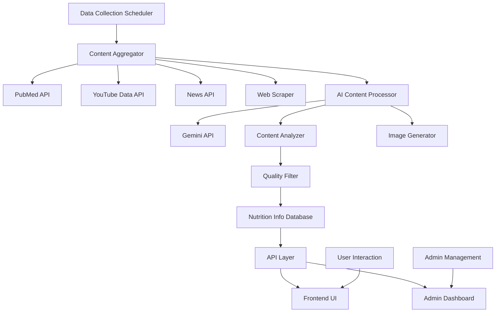

# Design Document

## Overview

AI 기반 최신 영양 정보 자동 포스팅 시스템은 다양한 외부 소스에서 영양학 관련 정보를 자동으로 수집하고, AI가 분석하여 사용자에게 이해하기 쉬운 형태로 제공하는 시스템입니다. 현재 정적인 영양 정보 섹션을 동적이고 지능적인 시스템으로 발전시켜 사용자들에게 항상 최신의 검증된 영양 정보를 제공합니다.

## Architecture

### System Architecture



### Data Flow

1. **수집 단계**: 스케줄러가 정기적으로 외부 소스에서 데이터 수집
2. **처리 단계**: AI가 수집된 데이터를 분석하고 요약
3. **검증 단계**: 품질 필터가 신뢰도 평가 및 중복 제거
4. **저장 단계**: 처리된 정보를 구조화된 형태로 데이터베이스에 저장
5. **제공 단계**: API를 통해 프론트엔드에 정보 제공

## Components and Interfaces

### 1. Data Collection Layer

#### Content Aggregator
```javascript
class ContentAggregator {
    async collectFromPubMed(keywords, limit = 10)
    async collectFromYouTube(channelIds, keywords, limit = 10)
    async collectFromNews(keywords, sources, limit = 10)
    async scheduleCollection(interval = '0 */6 * * *') // 6시간마다
}
```

#### External API Interfaces
- **PubMed API**: `https://eutils.ncbi.nlm.nih.gov/entrez/eutils/`
- **YouTube Data API**: `https://www.googleapis.com/youtube/v3/`
- **News API**: `https://newsapi.org/v2/`

### 2. AI Processing Layer

#### Content Processor
```javascript
class ContentProcessor {
    async analyzeContent(rawContent, sourceType)
    async generateSummary(content, language = 'ko')
    async extractKeywords(content)
    async generateImage(summary, style = 'nutrition')
    async calculateTrustScore(content, source)
}
```

#### Gemini Integration
```javascript
class GeminiAnalyzer {
    async summarizeNutritionContent(content)
    async translateToKorean(content)
    async extractNutritionFacts(content)
    async generateTags(content)
}
```

### 3. Data Management Layer

#### Nutrition Info Model
```javascript
const NutritionInfoSchema = {
    id: String,
    title: String,
    summary: String,
    originalContent: String,
    sourceType: String, // 'paper', 'youtube', 'news'
    sourceUrl: String,
    sourceName: String,
    author: String,
    publishedDate: Date,
    collectedDate: Date,
    trustScore: Number, // 0-100
    category: String, // 'diet', 'supplements', 'research', 'trends'
    tags: [String],
    imageUrl: String,
    language: String,
    isActive: Boolean,
    viewCount: Number,
    likeCount: Number,
    bookmarkCount: Number
}
```

#### Database Operations
```javascript
class NutritionInfoService {
    async saveNutritionInfo(data)
    async getNutritionInfoList(filters, pagination)
    async getNutritionInfoById(id)
    async updateNutritionInfo(id, updates)
    async deleteNutritionInfo(id)
    async searchNutritionInfo(query, filters)
    async getRecommendedInfo(userId)
}
```

### 4. API Layer

#### REST API Endpoints
```
GET    /api/nutrition-info              # 영양 정보 목록 조회
GET    /api/nutrition-info/:id          # 특정 영양 정보 조회
POST   /api/nutrition-info/search       # 영양 정보 검색
GET    /api/nutrition-info/categories   # 카테고리 목록
GET    /api/nutrition-info/recommended  # 개인화 추천
POST   /api/nutrition-info/bookmark     # 북마크 추가/제거
POST   /api/nutrition-info/like         # 좋아요 추가/제거

# Admin APIs
POST   /api/admin/nutrition-info/collect    # 수동 수집 트리거
GET    /api/admin/nutrition-info/stats      # 수집 통계
PUT    /api/admin/nutrition-info/:id/status # 정보 상태 변경
DELETE /api/admin/nutrition-info/:id        # 정보 삭제
```

### 5. Frontend Components

#### Main Nutrition Info Page
```javascript
class NutritionInfoPage {
    // 필터링 및 검색 기능
    renderFilterBar()
    renderSearchBox()
    
    // 정보 표시
    renderNutritionCards()
    renderPagination()
    
    // 상호작용
    handleBookmark()
    handleLike()
    handleShare()
}
```

#### Nutrition Info Card Component
```javascript
class NutritionInfoCard {
    // 카드 렌더링
    renderThumbnail()
    renderTitle()
    renderSummary()
    renderMetadata()
    renderActions()
    
    // 이벤트 처리
    handleClick()
    handleBookmark()
    handleLike()
}
```

## Data Models

### Core Data Structures

#### Nutrition Information
```json
{
  "id": "nutrition_20250119_001",
  "title": "지중해식 식단의 심혈관 질환 예방 효과",
  "summary": "최근 연구에 따르면 지중해식 식단이 심혈관 질환 위험을 30% 감소시키는 것으로 나타났습니다...",
  "originalContent": "Full content from source...",
  "sourceType": "paper",
  "sourceUrl": "https://pubmed.ncbi.nlm.nih.gov/...",
  "sourceName": "Journal of Nutrition",
  "author": "Dr. Smith et al.",
  "publishedDate": "2025-01-15T00:00:00Z",
  "collectedDate": "2025-01-19T10:30:00Z",
  "trustScore": 85,
  "category": "diet",
  "tags": ["지중해식단", "심혈관", "예방", "연구"],
  "imageUrl": "/images/nutrition/mediterranean_diet.jpg",
  "language": "ko",
  "isActive": true,
  "viewCount": 0,
  "likeCount": 0,
  "bookmarkCount": 0
}
```

#### Collection Configuration
```json
{
  "pubmed": {
    "keywords": ["nutrition", "diet", "supplements", "health"],
    "maxResults": 20,
    "dateRange": "30d"
  },
  "youtube": {
    "channels": [
      "UC_nutrition_channel_1",
      "UC_nutrition_channel_2"
    ],
    "keywords": ["영양", "건강", "식단"],
    "maxResults": 15
  },
  "news": {
    "sources": ["health-news", "nutrition-today"],
    "keywords": ["영양", "건강식품", "다이어트"],
    "maxResults": 25
  }
}
```

#### User Preferences
```json
{
  "userId": "user123",
  "preferences": {
    "categories": ["diet", "supplements"],
    "sourceTypes": ["paper", "news"],
    "keywords": ["비타민", "단백질", "다이어트"],
    "language": "ko"
  },
  "interactions": {
    "bookmarks": ["nutrition_20250119_001"],
    "likes": ["nutrition_20250119_002"],
    "views": ["nutrition_20250119_001", "nutrition_20250119_002"]
  }
}
```

## Error Handling

### API Error Responses
```javascript
const ErrorTypes = {
    COLLECTION_FAILED: 'COLLECTION_FAILED',
    PROCESSING_FAILED: 'PROCESSING_FAILED',
    INVALID_SOURCE: 'INVALID_SOURCE',
    RATE_LIMIT_EXCEEDED: 'RATE_LIMIT_EXCEEDED',
    CONTENT_NOT_FOUND: 'CONTENT_NOT_FOUND'
}

class NutritionInfoError extends Error {
    constructor(type, message, details = {}) {
        super(message)
        this.type = type
        this.details = details
    }
}
```

### Error Handling Strategy
1. **수집 오류**: 실패한 소스는 로그 기록 후 다음 스케줄에서 재시도
2. **처리 오류**: AI 분석 실패 시 원본 콘텐츠 보존하고 수동 검토 대기열에 추가
3. **API 제한**: 레이트 리미트 도달 시 백오프 전략 적용
4. **데이터 무결성**: 중복 데이터 감지 시 최신 정보로 업데이트

## Testing Strategy

### Unit Testing
- **Data Collection**: 각 소스별 API 호출 및 데이터 파싱 테스트
- **AI Processing**: Gemini API 응답 처리 및 요약 품질 테스트
- **Data Management**: CRUD 작업 및 검색 기능 테스트

### Integration Testing
- **End-to-End Flow**: 수집부터 표시까지 전체 플로우 테스트
- **API Testing**: REST API 엔드포인트 기능 및 성능 테스트
- **Error Scenarios**: 외부 API 장애 상황 시뮬레이션

### Performance Testing
- **Load Testing**: 동시 사용자 요청 처리 능력 테스트
- **Data Volume**: 대량 데이터 수집 및 처리 성능 테스트
- **Caching**: 캐시 효율성 및 응답 시간 개선 테스트

### Quality Assurance
- **Content Quality**: AI 요약의 정확성 및 가독성 평가
- **Trust Score**: 신뢰도 점수 알고리즘 정확성 검증
- **User Experience**: 프론트엔드 사용성 및 접근성 테스트

## Security Considerations

### API Security
- **Rate Limiting**: 외부 API 호출 제한 및 백오프 전략
- **API Key Management**: 환경 변수를 통한 안전한 키 관리
- **Input Validation**: 사용자 입력 및 외부 데이터 검증

### Data Security
- **Content Filtering**: 부적절한 콘텐츠 자동 필터링
- **Source Verification**: 신뢰할 수 있는 소스만 수집
- **Privacy Protection**: 개인 정보 포함 콘텐츠 제외

### System Security
- **Access Control**: 관리자 기능에 대한 인증 및 권한 관리
- **Audit Logging**: 시스템 작업 및 사용자 활동 로깅
- **Backup Strategy**: 데이터 백업 및 복구 계획

## Performance Optimization

### Caching Strategy
- **Content Caching**: 자주 조회되는 영양 정보 메모리 캐싱
- **API Response Caching**: 외부 API 응답 임시 저장
- **Image Caching**: 생성된 이미지 CDN 활용

### Database Optimization
- **Indexing**: 검색 및 필터링 성능 향상을 위한 인덱스 설정
- **Pagination**: 대량 데이터 효율적 로딩
- **Data Archiving**: 오래된 데이터 아카이빙 전략

### Resource Management
- **Memory Management**: 대용량 콘텐츠 처리 시 메모리 효율성
- **CPU Optimization**: AI 처리 작업 병렬화
- **Network Optimization**: 외부 API 호출 최적화