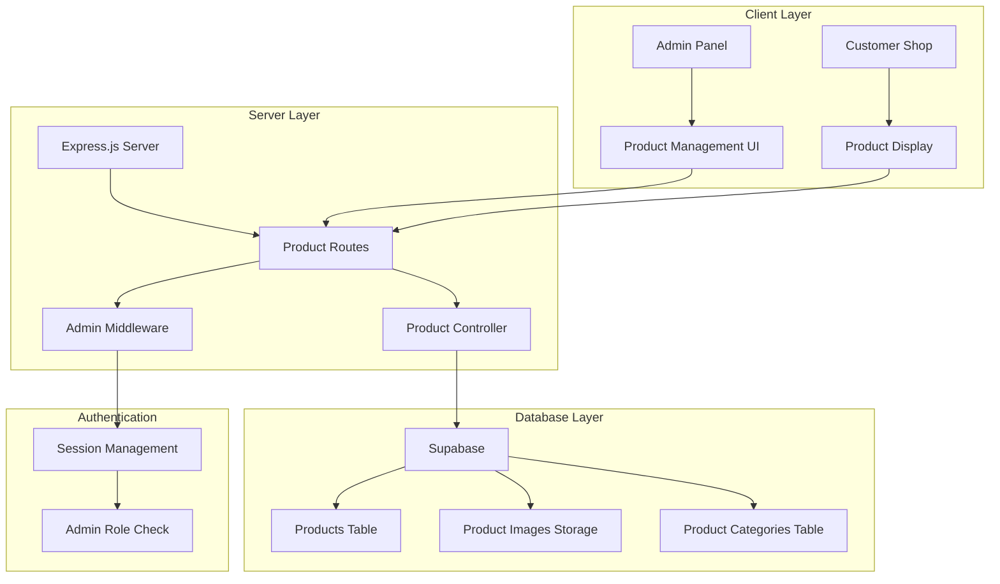

# Design Document

## Overview

The shop product management system will extend the existing 잇플 (Eatple) application with comprehensive admin-only product management capabilities. The system will integrate seamlessly with the current Express.js server architecture and Supabase database, providing a secure, responsive interface for managing shop products while maintaining the existing customer-facing shop experience.

The design follows a modular approach with clear separation between admin and customer interfaces, leveraging the existing authentication system and extending the current admin panel structure.

## Architecture

### System Architecture



### Database Schema Design

#### Products Table
```sql
CREATE TABLE products (
    id UUID PRIMARY KEY DEFAULT gen_random_uuid(),
    name VARCHAR(255) NOT NULL,
    description TEXT,
    price INTEGER NOT NULL, -- Price in KRW
    category VARCHAR(100) NOT NULL,
    image_url TEXT,
    image_path TEXT, -- Supabase storage path
    status VARCHAR(20) DEFAULT 'active', -- active, inactive, out_of_stock
    created_at TIMESTAMP WITH TIME ZONE DEFAULT NOW(),
    updated_at TIMESTAMP WITH TIME ZONE DEFAULT NOW(),
    created_by UUID REFERENCES auth.users(id),
    view_count INTEGER DEFAULT 0,
    purchase_count INTEGER DEFAULT 0
);
```

#### Product Categories Table
```sql
CREATE TABLE product_categories (
    id UUID PRIMARY KEY DEFAULT gen_random_uuid(),
    name VARCHAR(100) UNIQUE NOT NULL,
    display_name VARCHAR(100) NOT NULL,
    description TEXT,
    created_at TIMESTAMP WITH TIME ZONE DEFAULT NOW()
);
```

#### Product Analytics Table
```sql
CREATE TABLE product_analytics (
    id UUID PRIMARY KEY DEFAULT gen_random_uuid(),
    product_id UUID REFERENCES products(id) ON DELETE CASCADE,
    event_type VARCHAR(50) NOT NULL, -- view, purchase, cart_add
    user_id UUID REFERENCES auth.users(id),
    session_id VARCHAR(255),
    created_at TIMESTAMP WITH TIME ZONE DEFAULT NOW()
);
```

### File Structure

```
├── public/
│   ├── admin-product-management.html    # Admin product management page
│   ├── admin-product-management.js      # Admin product management logic
│   └── admin-product-management.css     # Admin product management styles
├── routes/
│   └── admin-products.js                # Admin product routes
├── utils/
│   ├── productManager.js                # Product management utilities
│   └── imageUploadHandler.js            # Image upload handling
└── migrations/
    └── create_product_tables.sql         # Database migration
```

## Components and Interfaces

### 1. Admin Product Management Interface

#### Main Dashboard
- **Product Overview Cards**: Display total products, active products, categories, and recent activity
- **Quick Actions**: Add new product, bulk operations, category management
- **Search and Filter Bar**: Real-time search with category, status, and date filters
- **Product Grid/List View**: Toggle between card and table views

#### Product Form Component
- **Basic Information Section**: Name, description, price input fields
- **Category Management**: Dropdown with existing categories + add new category option
- **Image Upload Component**: Drag-and-drop interface with preview and optimization
- **Status Management**: Active/Inactive toggle with out-of-stock option
- **Validation**: Real-time form validation with error messaging

#### Product List Component
- **Sortable Columns**: Name, price, category, status, created date
- **Bulk Selection**: Checkbox selection with bulk actions (activate, deactivate, delete)
- **Inline Actions**: Quick edit, delete, view analytics buttons
- **Pagination**: Server-side pagination with configurable page sizes

### 2. Customer Shop Integration

#### Updated Shop Component
- **Dynamic Product Loading**: Fetch products from Supabase instead of hardcoded data
- **Category Filtering**: Filter products by category
- **Status Filtering**: Only show active products to customers
- **Real-time Updates**: Reflect admin changes immediately

### 3. API Endpoints

#### Admin Product Routes (`/api/admin/products`)
```javascript
// Product CRUD operations
GET    /api/admin/products              // List products with pagination/filtering
POST   /api/admin/products              // Create new product
GET    /api/admin/products/:id          // Get single product
PUT    /api/admin/products/:id          // Update product
DELETE /api/admin/products/:id          // Delete product

// Bulk operations
POST   /api/admin/products/bulk         // Bulk operations (activate, deactivate, delete)

// Image management
POST   /api/admin/products/upload-image // Upload product image
DELETE /api/admin/products/image/:id    // Delete product image

// Categories
GET    /api/admin/product-categories    // List categories
POST   /api/admin/product-categories    // Create category
PUT    /api/admin/product-categories/:id // Update category
DELETE /api/admin/product-categories/:id // Delete category

// Analytics
GET    /api/admin/products/:id/analytics // Get product analytics
```

#### Customer Shop Routes (`/api/shop`)
```javascript
GET    /api/shop/products               // List active products for customers
GET    /api/shop/products/:id           // Get single product for customers
GET    /api/shop/categories             // List active categories
POST   /api/shop/products/:id/view      // Track product view
```

### 4. Authentication and Authorization

#### Admin Middleware Enhancement
```javascript
// Extend existing admin middleware
const adminProductAuth = (req, res, next) => {
    // Check if user is logged in
    if (!req.session || !req.session.user) {
        return res.status(401).json({ error: '로그인이 필요합니다.' });
    }
    
    // Check if user has admin role
    if (req.session.user.role !== 'admin') {
        return res.status(403).json({ error: '관리자 권한이 필요합니다.' });
    }
    
    next();
};
```

## Data Models

### Product Model
```javascript
class Product {
    constructor(data) {
        this.id = data.id;
        this.name = data.name;
        this.description = data.description;
        this.price = data.price;
        this.category = data.category;
        this.imageUrl = data.image_url;
        this.imagePath = data.image_path;
        this.status = data.status;
        this.createdAt = data.created_at;
        this.updatedAt = data.updated_at;
        this.createdBy = data.created_by;
        this.viewCount = data.view_count || 0;
        this.purchaseCount = data.purchase_count || 0;
    }
    
    // Validation methods
    validate() {
        const errors = [];
        if (!this.name || this.name.trim().length === 0) {
            errors.push('상품명은 필수입니다.');
        }
        if (!this.price || this.price <= 0) {
            errors.push('가격은 0보다 커야 합니다.');
        }
        if (!this.category || this.category.trim().length === 0) {
            errors.push('카테고리는 필수입니다.');
        }
        return errors;
    }
    
    // Format for customer display
    toCustomerFormat() {
        return {
            id: this.id,
            name: this.name,
            description: this.description,
            price: this.price,
            category: this.category,
            image: this.imageUrl || '💊', // Default emoji if no image
            status: this.status
        };
    }
}
```

### Category Model
```javascript
class ProductCategory {
    constructor(data) {
        this.id = data.id;
        this.name = data.name;
        this.displayName = data.display_name;
        this.description = data.description;
        this.createdAt = data.created_at;
    }
    
    validate() {
        const errors = [];
        if (!this.name || this.name.trim().length === 0) {
            errors.push('카테고리 이름은 필수입니다.');
        }
        if (!this.displayName || this.displayName.trim().length === 0) {
            errors.push('표시 이름은 필수입니다.');
        }
        return errors;
    }
}
```

## Error Handling

### Client-Side Error Handling
```javascript
class ProductManagementError {
    static handle(error, context) {
        console.error(`Product Management Error [${context}]:`, error);
        
        // Display user-friendly error messages
        const errorMessages = {
            'NETWORK_ERROR': '네트워크 연결을 확인해주세요.',
            'VALIDATION_ERROR': '입력 정보를 확인해주세요.',
            'PERMISSION_ERROR': '권한이 없습니다.',
            'SERVER_ERROR': '서버 오류가 발생했습니다.',
            'IMAGE_UPLOAD_ERROR': '이미지 업로드에 실패했습니다.'
        };
        
        const message = errorMessages[error.type] || '알 수 없는 오류가 발생했습니다.';
        this.showErrorToast(message);
    }
    
    static showErrorToast(message) {
        // Implementation for showing error toast
    }
}
```

### Server-Side Error Handling
```javascript
const handleProductError = (error, req, res, next) => {
    console.error('Product Management Error:', error);
    
    if (error.name === 'ValidationError') {
        return res.status(400).json({
            success: false,
            error: '입력 데이터가 유효하지 않습니다.',
            details: error.details
        });
    }
    
    if (error.code === '23505') { // Unique constraint violation
        return res.status(409).json({
            success: false,
            error: '이미 존재하는 상품입니다.'
        });
    }
    
    res.status(500).json({
        success: false,
        error: '서버 오류가 발생했습니다.'
    });
};
```

## Testing Strategy

### Unit Tests
- **Product Model Validation**: Test all validation rules and edge cases
- **Category Management**: Test category CRUD operations
- **Image Upload**: Test image processing and storage
- **Authentication**: Test admin permission checks

### Integration Tests
- **API Endpoints**: Test all product management endpoints
- **Database Operations**: Test Supabase integration
- **File Upload**: Test image upload to Supabase Storage
- **Customer Shop Integration**: Test product display updates

### End-to-End Tests
- **Admin Workflow**: Complete product creation and management flow
- **Customer Experience**: Product browsing and purchasing flow
- **Responsive Design**: Test on various screen sizes
- **Error Scenarios**: Test error handling and recovery

### Performance Tests
- **Product List Loading**: Test pagination and filtering performance
- **Image Upload**: Test large image handling and optimization
- **Concurrent Operations**: Test multiple admin users managing products
- **Database Queries**: Test query optimization and indexing

## Security Considerations

### Authentication and Authorization
- **Session Validation**: Verify admin session on every request
- **Role-Based Access**: Strict admin-only access to management features
- **CSRF Protection**: Implement CSRF tokens for state-changing operations
- **Rate Limiting**: Prevent abuse of product management endpoints

### Data Validation
- **Input Sanitization**: Sanitize all user inputs to prevent XSS
- **File Upload Security**: Validate file types, sizes, and scan for malware
- **SQL Injection Prevention**: Use parameterized queries
- **Price Validation**: Ensure prices are positive integers

### Image Security
- **File Type Validation**: Only allow safe image formats (JPG, PNG, WebP)
- **File Size Limits**: Enforce maximum file size (5MB)
- **Image Processing**: Strip metadata and resize images
- **Storage Security**: Use Supabase RLS policies for image access

## Performance Optimization

### Database Optimization
- **Indexing Strategy**: Index frequently queried columns (category, status, created_at)
- **Query Optimization**: Use efficient queries with proper joins
- **Connection Pooling**: Optimize database connection management
- **Caching**: Implement Redis caching for frequently accessed products

### Image Optimization
- **Automatic Resizing**: Generate multiple image sizes for different use cases
- **Format Optimization**: Convert images to WebP for better compression
- **CDN Integration**: Use Supabase CDN for fast image delivery
- **Lazy Loading**: Implement lazy loading for product images

### Frontend Optimization
- **Code Splitting**: Split admin and customer code bundles
- **Lazy Loading**: Load components on demand
- **Caching**: Implement browser caching for static assets
- **Minification**: Minify CSS and JavaScript files

## Responsive Design Strategy

### Mobile-First Approach
- **Breakpoints**: 
  - Mobile: 320px - 768px
  - Tablet: 768px - 1024px
  - Desktop: 1024px+

### Component Adaptations
- **Product Grid**: 1 column on mobile, 2-3 on tablet, 4+ on desktop
- **Admin Forms**: Stack form fields vertically on mobile
- **Navigation**: Collapsible hamburger menu on mobile
- **Tables**: Convert to card layout on mobile devices

### Touch Optimization
- **Button Sizes**: Minimum 44px touch targets
- **Gesture Support**: Swipe gestures for product navigation
- **Form Inputs**: Optimized keyboard types for different input fields
- **Loading States**: Clear loading indicators for touch interactions

## Integration Points

### Existing System Integration
- **Admin Panel**: Extend current admin.html with product management section
- **Authentication**: Use existing session-based authentication
- **Styling**: Extend current style.css with product management styles
- **Navigation**: Add product management link to admin navigation

### Shop Integration
- **Product Loading**: Replace hardcoded products with database queries
- **Real-time Updates**: Implement WebSocket updates for product changes
- **Point System**: Maintain existing point discount functionality
- **Purchase Flow**: Integrate with existing purchase processing

### Supabase Integration
- **Database Tables**: Create new tables with proper relationships
- **Storage**: Use Supabase Storage for product images
- **Real-time**: Leverage Supabase real-time for live updates
- **Row Level Security**: Implement RLS policies for data protection