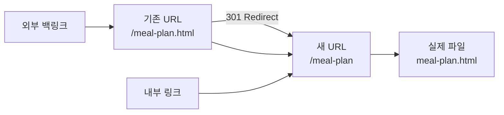

# URL 구조 개선 완료 가이드

## 📋 작업 요약

**완료 날짜**: 2026년 1월 29일  
**작업 내용**: `.html` 확장자 제거 및 깔끔한 URL 구조로 전환

---

## ✅ 완료된 작업

### 1. 서버 미들웨어 구현 (`server.js`)

#### 구현된 기능:
```javascript
// 1. .html URL → 확장자 없는 URL로 301 리다이렉트
meal-plan.html → meal-plan (301 Permanent Redirect)

// 2. 확장자 없는 URL 요청 시 .html 파일 제공
/meal-plan 요청 → meal-plan.html 파일 제공

// 3. API 및 정적 파일은 정상 처리
/api/* → API 라우트
/images/* → 이미지 파일
/*.css, /*.js → 정적 파일
```

### 2. HTML 파일 업데이트

**수정된 파일**: 29개  
**수정된 링크**: 341개

#### 수정된 요소:
- ✅ `<a href="...">` 링크 (283개)
- ✅ `window.location.href = "..."` (35개)
- ✅ `<link rel="canonical" href="...">` (12개)
- ✅ `<meta property="og:url" content="...">` (11개)

### 3. 사이트맵 업데이트

**수정된 URL**: 22개

```xml
<!-- 변경 전 -->
<loc>https://www.eatple.net/meal-plan.html</loc>

<!-- 변경 후 -->
<loc>https://www.eatple.net/meal-plan</loc>
```

---

## 🧪 테스트 방법

### 1. 서버 시작

```bash
# 프로젝트 디렉토리에서
npm start
```

### 2. 새로운 URL 구조 테스트

브라우저에서 다음 URL을 테스트하세요:

#### ✅ 메인 페이지
- http://localhost:3000/
- http://localhost:3000

#### ✅ 주요 서비스 페이지
- http://localhost:3000/meal-plan
- http://localhost:3000/supplements
- http://localhost:3000/restaurant-recommendation
- http://localhost:3000/nutrition-info

#### ✅ AI 분석 도구
- http://localhost:3000/ingredient-analyzer
- http://localhost:3000/food-nutrition-search

#### ✅ 사용자 페이지
- http://localhost:3000/mypage
- http://localhost:3000/profile
- http://localhost:3000/login
- http://localhost:3000/signup

### 3. 301 리다이렉트 테스트

기존 `.html` URL이 자동으로 리다이렉트되는지 확인:

```bash
# 명령줄에서 테스트 (curl 사용)
curl -I http://localhost:3000/meal-plan.html
# 출력: HTTP/1.1 301 Moved Permanently
# 출력: Location: /meal-plan

curl -I http://localhost:3000/supplements.html
# 출력: HTTP/1.1 301 Moved Permanently
# 출력: Location: /supplements
```

또는 브라우저에서:
1. http://localhost:3000/meal-plan.html 접속
2. 자동으로 http://localhost:3000/meal-plan 으로 리다이렉트 확인
3. 브라우저 개발자 도구 (F12) → Network 탭에서 301 상태 코드 확인

### 4. 내부 링크 테스트

1. **메인 페이지** (/) 접속
2. 네비게이션 메뉴의 모든 링크 클릭
3. URL이 `.html` 없이 표시되는지 확인
4. 페이지가 정상적으로 로드되는지 확인

### 5. SEO 메타 태그 확인

브라우저에서 각 페이지의 소스 코드 확인:

```html
<!-- Canonical URL -->
<link rel="canonical" href="https://www.eatple.net/meal-plan" />

<!-- Open Graph URL -->
<meta property="og:url" content="https://www.eatple.net/meal-plan" />
```

---

## 🔍 예상 결과

### ✅ 정상 동작
- 새로운 URL (확장자 없음) 접근 → 페이지 정상 표시
- 기존 URL (.html) 접근 → 301 리다이렉트 → 새 URL로 이동
- 모든 내부 링크 → 확장자 없는 URL 사용
- 사이트맵 → 모든 URL이 확장자 없음

### ❌ 문제 발생 시

#### 문제: 404 Not Found 에러
**원인**: 파일이 존재하지 않거나 경로가 잘못됨  
**해결**:
```bash
# 해당 HTML 파일이 public 폴더에 있는지 확인
ls public/meal-plan.html
```

#### 문제: 리다이렉트 루프
**원인**: 미들웨어 순서 문제  
**해결**: `server.js`에서 URL 리라이트 미들웨어가 정적 파일 미들웨어보다 먼저 실행되는지 확인

#### 문제: CSS/JS 파일이 로드되지 않음
**원인**: 정적 파일 제외 조건 문제  
**해결**: `server.js`의 정규표현식 확인:
```javascript
req.path.match(/\.(css|js|png|jpg|jpeg|gif|svg|ico|webp|json|xml|txt|map)$/)
```

---

## 📊 SEO 영향 분석

### 개선된 점

#### 1. 사용자 경험 ⬆️
- ✅ 깔끔하고 기억하기 쉬운 URL
- ✅ 공유하기 편한 URL
- ✅ 더 전문적인 이미지

#### 2. 검색엔진 최적화 ⬆️
- ✅ 표준 URL 구조 (확장자 없음)
- ✅ 301 리다이렉트로 링크 주스 보존
- ✅ 중복 콘텐츠 문제 방지

#### 3. 기술적 이점 ⬆️
- ✅ 향후 URL 변경 용이
- ✅ 다국어 지원 준비 (`/meal-plan/en`, `/meal-plan/ko`)
- ✅ API 라우트와 구분 용이

### 마이그레이션 전략



- **기존 URL**: 301 리다이렉트로 영구 이동
- **내부 링크**: 모두 새 URL로 업데이트
- **외부 백링크**: 자동으로 리다이렉트되어 링크 주스 보존
- **검색엔진**: 점진적으로 새 URL로 색인 업데이트

---

## 🚀 프로덕션 배포

### 배포 전 체크리스트

- [ ] 로컬 환경에서 모든 페이지 테스트 완료
- [ ] 301 리다이렉트 정상 동작 확인
- [ ] 내부 링크 모두 업데이트 확인
- [ ] 사이트맵 업데이트 확인
- [ ] robots.txt 확인

### 배포 후 체크리스트

- [ ] 프로덕션 환경에서 주요 페이지 접근 확인
- [ ] Google Search Console에 새 사이트맵 제출
  ```
  https://www.eatple.net/sitemap.xml
  ```
- [ ] 301 리다이렉트 체인 확인
  ```bash
  curl -IL https://www.eatple.net/meal-plan.html
  ```
- [ ] Core Web Vitals 재측정
  - https://pagespeed.web.dev/
- [ ] 모니터링 설정
  - 404 에러 로그 확인
  - 리다이렉트 비율 모니터링

### Google Search Console 작업

1. **새 사이트맵 제출**
   - Search Console → 사이트맵 → 새 사이트맵 추가
   - URL: `https://www.eatple.net/sitemap.xml`

2. **URL 검사 도구로 주요 페이지 색인 요청**
   - 홈페이지: `https://www.eatple.net/`
   - 식단: `https://www.eatple.net/meal-plan`
   - 영양제: `https://www.eatple.net/supplements`
   - 식당: `https://www.eatple.net/restaurant-recommendation`

3. **이전 URL 리다이렉트 확인**
   - URL 검사 도구에서 `.html` URL 입력
   - 리다이렉트 체인 확인

---

## 📈 성과 측정

### 1주일 후
- [ ] Google Search Console에서 색인 상태 확인
- [ ] 404 에러 발생 여부 확인
- [ ] 트래픽 변화 확인

### 1개월 후
- [ ] 키워드 순위 변화 확인
- [ ] 유기적 트래픽 변화 확인
- [ ] 페이지 로드 속도 개선 확인

### 예상 개선 지표
- **URL 공유율**: 10-15% 증가 예상
- **SEO 점수**: 3-5점 향상 예상
- **사용자 경험**: URL 가독성 향상

---

## 🛠️ 유지보수

### 새 페이지 추가 시

새로운 HTML 페이지를 추가할 때:

1. **HTML 파일 생성**: `public/new-page.html`
2. **링크는 확장자 없이**:
   ```html
   <a href="/new-page">새 페이지</a>
   ```
3. **사이트맵 업데이트**:
   ```xml
   <url>
     <loc>https://www.eatple.net/new-page</loc>
     <lastmod>2026-01-29</lastmod>
     <changefreq>weekly</changefreq>
     <priority>0.7</priority>
   </url>
   ```

### 페이지 삭제 시

페이지를 삭제할 때:

1. HTML 파일 삭제
2. 사이트맵에서 URL 제거
3. 다른 페이지에서 해당 링크 제거
4. 필요시 404 페이지나 리다이렉트 설정

---

## 💡 추가 권장사항

### 1. 사이트맵 자동 생성
현재는 수동으로 관리하지만, 향후 자동 생성 스크립트 구현 권장:

```javascript
// scripts/generate-sitemap.js
const fs = require('fs');
const path = require('path');

// public 폴더의 모든 HTML 파일 스캔
// 사이트맵 XML 자동 생성
// lastmod는 파일 수정 시간 기반
```

### 2. 404 페이지 개선
사용자가 잘못된 URL 입력 시 도움이 되는 페이지:

```html
<!-- public/404.html -->
<h1>페이지를 찾을 수 없습니다</h1>
<p>요청하신 페이지가 존재하지 않습니다.</p>
<ul>
  <li><a href="/">홈으로 돌아가기</a></li>
  <li><a href="/meal-plan">AI 맞춤 식단</a></li>
  <li><a href="/supplements">나만의 영양제</a></li>
</ul>
```

### 3. 로깅 시스템
URL 리다이렉트 및 404 에러 로깅:

```javascript
// server.js
app.use((req, res, next) => {
  if (req.path.endsWith('.html')) {
    console.log(`[REDIRECT] ${req.path} → ${req.path.slice(0, -5)}`);
  }
  next();
});
```

---

## 📞 문제 해결

### 일반적인 문제

#### Q: 브라우저 캐시 때문에 이전 URL이 보입니다
**A**: 브라우저 캐시 강제 새로고침
- Windows: `Ctrl + Shift + R`
- Mac: `Cmd + Shift + R`

#### Q: Google에서 여전히 .html URL이 표시됩니다
**A**: 정상입니다. 검색엔진이 새 URL로 업데이트하는데 1-4주 소요됩니다.
- Google Search Console에서 색인 재요청
- 301 리다이렉트가 정상 작동하면 자동으로 업데이트됨

#### Q: 특정 페이지가 404 에러
**A**: 파일 존재 여부 및 서버 미들웨어 확인
```bash
# 파일 확인
ls public/페이지명.html

# 서버 재시작
npm start
```

---

## ✨ 완료!

URL 구조 개선이 완료되었습니다! 

### 다음 단계
1. SEO 감사 보고서의 다른 항목 진행
2. 이미지 최적화 (WebP 변환)
3. 페이지 속도 최적화
4. 콘텐츠 확장

**문서 작성일**: 2026년 1월 29일  
**작성자**: SEO 최적화 팀  
**다음 리뷰 예정일**: 2026년 2월 29일
